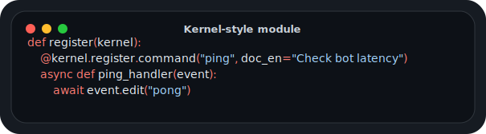
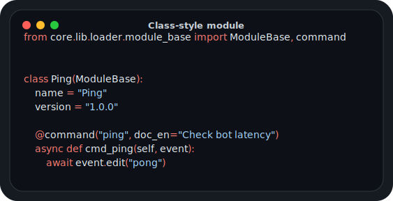
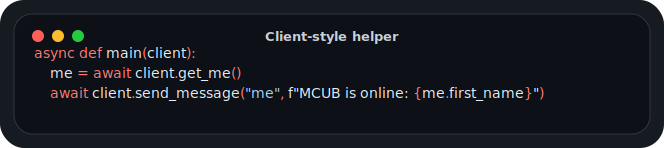

# MCUB Module API Documentation

> **Version:** 1.3.3

> [!IMPORTANT]
> Recent Telethon-MCUB changes: [CHANGELOG.md](https://github.com/hairpin01/Telethon-MCUB/blob/v1/CHANGELOG.md)

  
<b>Code style</b>

  > Local SVG cards are generated by `python3 tools/render_doc_code_cards.py`.
  > Keep the normal Markdown code blocks in pages for copy/paste.

  **Kernel-style**

  

  

  

  **Class-style**

  

  

  

  **Client-style**

  

  

  

---

## Getting Started

| Document | Description |
|----------|-------------|
| [Introduction](doc/getting-started/index.md) | Quick introduction to MCUB |
| [Module Structure](doc/guides/module-structure.md) | Basic module format and directives |

---

## Guides

| Document | Description |
|----------|-------------|
| [Best Practices](doc/guides/best-practices.md) | Recommended patterns for modules |
| [Custom Core](doc/guides/custom-core.md) | Creating custom kernel cores |
| [Localization (i18n)](doc/guides/i18n.md) | Multi-language support |
| [Pipeline](doc/guides/pipeline.md) | Command pipeline chaining |

---

## API Reference

### Core

| Document | Description |
|----------|-------------|
| [Kernel API](doc/api/kernel.md) | Core kernel variables and methods |
| [Module API](doc/api/module-api.md) | Module loading and repository management |
| [Scheduler API](doc/api/scheduler.md) | Extended task scheduler methods |
| [Dependencies](doc/api/dependencies.md) | Module dependency management and auto-install |
| [Archives](doc/api/archives.md) | Archive module installation (ZIP, tar.gz) |
| [Exceptions](doc/api/exceptions.md) | Custom exception reference |

### Data & Config

| Document | Description |
|----------|-------------|
| [Database API](doc/api/database.md) | Database and key-value storage |
| [Module Config API](doc/api/module-config.md) | Module configuration system |
| [Cache API](doc/api/cache.md) | TTL cache operations |
| [Config Management](doc/api/config.md) | Reading/writing kernel config |

### Commands & Events

| Document | Description |
|----------|-------------|
| [Command Registration](doc/api/commands.md) | Registering commands and aliases |
| [Event Handlers](doc/api/events.md) | Event handler registration |
| [Middleware API](doc/api/middleware.md) | Event middleware |
| [Error Handling](doc/api/errors.md) | Error handling patterns |

### Utils

| Document | Description |
|----------|-------------|
| [Core Utils](doc/utils/core-utils.md) | Utility functions and helpers |
| [Custom Placeholders API](doc/utils/core-utils.md#custom-placeholders-api) | Placeholder decorators, rendering helpers, and config integration |
| [Colors API](doc/utils/colors.md) | Terminal color codes and gradient effects |
| [Examples](doc/utils/examples.md) | Complete module examples |

---

## Registration API

| Document | Description |
|----------|-------------|
| [Enhanced Registration](doc/registration/enhanced-api.md) | Decorator-based registration |
| [Class-Style Modules](doc/registration/class-style.md) | Object-oriented `ModuleBase` modules and class decorators |
| [Watchers](doc/registration/watchers.md) | Passive message watchers |
| [InfiniteLoop](doc/registration/loops.md) | Background loops |
| [Lifecycle Callbacks](doc/registration/lifecycle.md) | on_load, on_install, uninstall |
| [New Methods v1.0.3](doc/registration/new-methods.md) | Query and unregister handlers |
| [Class-Style Modules](doc/registration/class-style.md) | Class-style registration, instance helpers, ButtonFactory, lifecycle |

---

## Inline Tools

| Document | Description |
|----------|-------------|
| [Inline Form](doc/inline/inline-form.md) | Inline forms, gallery, list, pagination |
| [InlineManager API](doc/inline/inline-manager.md) | Gallery, list, paginated text, query-and-click |
| [Inline Result Builders](doc/inline/inline-results.md) | Build inline query results (text, photo, video, document) |
| [Callbacks](doc/inline/callbacks.md) | Callback permission management |

---

## Reference

| Document | Description |
|----------|-------------|
| [Premium Emoji](doc/reference/emoji.md) | Custom emoji usage |
| [Telethon-MCUB](doc/reference/telethon.md) | Additional Telethon methods |
| [AntiScam](doc/reference/antiscam.md) | Account protection |
| [xlib](doc/lib/xlib.md) | Extended helpers and compatibility utilities |

---

## Quick Links

- [GitHub Repository](https://github.com/hairpin01/MCUB-fork)
- [Module Repository](https://github.com/hairpin01/repo-MCUB-fork)
- [Telethon-MCUB Changelog](https://github.com/hairpin01/Telethon-MCUB/blob/v1/CHANGELOG.md)
