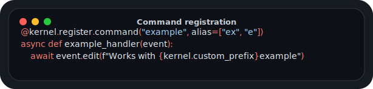

# Command Registration

<p align="center">
  
</p>

← [Index](../../API_DOC.md)

> [!NOTE]
> This is the canonical command-registration reference. Other registration pages
> link here instead of repeating the same command, alias and documentation rules.

## Standard Registration

```python
@kernel.register.command('example')
async def example_handler(event):
    await event.edit("Example command")
```

## Registration with Aliases

```python
@kernel.register.command('example', alias=['ex', 'e'])
async def example_handler(event):
    await event.edit(f"Works with {kernel.custom_prefix}example")
```

## Bot Commands

`@kernel.register.bot_command(...)` registers a native Telegram `/command` on the
bot account. It accepts the same `pattern`, `alias` and documentation arguments
as `@kernel.register.command(...)`.

```python
@kernel.register.bot_command('start', doc_en='Start')
async def start_handler(event):
    await event.respond("Hello from bot!")
```

## Multiple Commands

```python
def register(kernel):
    @kernel.register.command('cmd1')
    async def handler1(event):
        await event.edit("Command 1")

    @kernel.register.command('cmd2')
    async def handler2(event):
        await event.edit("Command 2")
```

## Owner-Only Commands

```python
@kernel.register.command('admincmd')
@kernel.register.owner(only_admin=True)
async def admin_only_handler(event):
    await event.edit("Admin only!")

@kernel.register.command('trustedcmd')
@kernel.register.owner()
async def trusted_handler(event):
    await event.edit("Admin or trusted user!")
```

## Decorators

`kernel.register.owner(only_admin=False)` - Decorator to restrict a handler to the bot owner (admin) or trusted users.

```python
@kernel.register.owner()
async def owner_or_trusted(event):
    await event.reply("Hello, owner!")

@kernel.register.owner(only_admin=True)
async def admin_only(event):
    await event.reply("Admin only!")
```

## Command Aliases Management

```python
aliases = kernel.register.get_all_aliases()
# {'ex': 'example', 'p': 'ping'}

cmd_alias = kernel.register.get_command_alias('ping')
# 'p' or None
```

`kernel.register.get_all_aliases()` - Get all registered command aliases.

`kernel.register.get_command_alias(command)` - Get the alias for a specific command.

## Class-Style Decorators

Class-style modules use `@command(...)`, `@bot_command(...)`, and
`@owner_only(...)` from `core.lib.loader.module_base`. The arguments and command
metadata rules are the same as the function-style API above; only the handler
signature changes because methods receive `self`.

```python
from core.lib.loader.module_base import ModuleBase, command


class Ping(ModuleBase):
    @command("ping", alias=["p"], doc_en="Ping")
    async def cmd_ping(self, event):
        await event.edit("Pong!")
```

## Command Documentation

You can add documentation for commands using `doc_<locale>` keyword parameters.
The locale suffix is arbitrary, so custom langpacks can use keys like `doc_rofl`, `doc_linux`, `doc_uk`, etc.
The `doc={...}` dict form is also supported as an alternative notation.

### Using separate locale parameters

```python
@kernel.register.command(
    'search',
    doc_en='[modules] search modules',
    doc_ru='[мoдyль] нaйди мoдyли',
    doc_rofl='[мoдyль] нy-кa пoищи этy дичь',
    doc_linux='grep -R module',
)
async def search_modules(event):
    await event.edit('Searching...')
```

### Compatibility: using `doc` dict

```python
@kernel.register.command('search', doc={
    'ru': '[мoдyль] нaйди мoдyли',
    'en': '[modules] search modules',
    'rofl': '[мoдyль] нy-кa пoищи этy дичь',
})
async def search_modules(event):
    await event.edit('Searching...')
```

### Getting command documentation

```python
cmd_info = kernel.register.get_command('search')
# {
#     'handler': <function>,
#     'owner': 'loader',
#     'docs': {
#         'ru': '[мoдyль] нaйди мoдyли',
#         'en': '[modules] search modules',
#         'rofl': '[мoдyль] нy-кa пoищи этy дичь',
#     }
# }

# Get just docs
docs = cmd_info['docs']  # {'ru': '...', 'en': '...', 'rofl': '...'}
```

## Inline Bot Information

```python
bot_info = kernel.register.get_use_bot()
# {'available': True, 'connected': True, 'username': 'MCUB_bot'}
```

`kernel.register.get_use_bot()` - Get information about inline bot usage.
