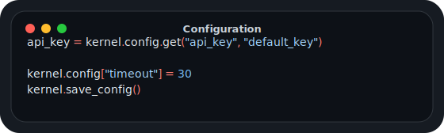

# Configuration Management

<p align="center">
  
</p>

← [Index](../../API_DOC.md)

## Reading Configuration

```python
# Get value with default
api_key = kernel.config.get('api_key', 'default_key')

# Direct access
timeout = kernel.config['timeout']
```

## Writing Configuration

```python
# Set value
kernel.config['new_setting'] = 'value'

# Save to disk
kernel.save_config()
```

## Configuration Structure

```json
{
    "command_prefix": ".",
    "log_chat_id": 0,
    "bot_username": "MCUB_bot",
    "language": "en"
}
```
