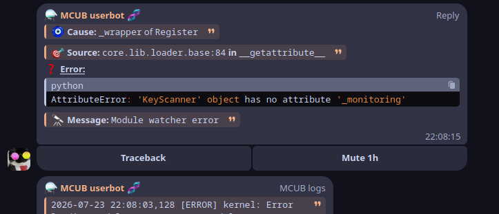
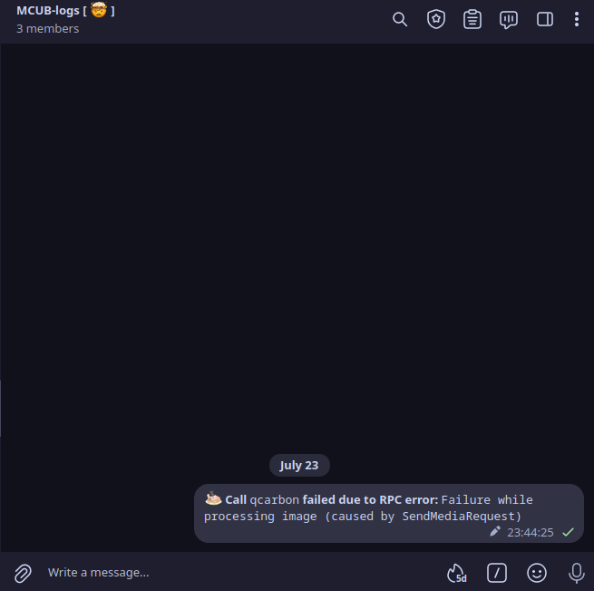

# Error Handling

← [Index](../../API_DOC.md)

## Telegram Preview

<p align="center">
  
</p>

<p align="center">
  
</p>

## Basic Error Handling

```python
@kernel.register.command('risky')
async def risky_handler(event):
    try:
        result = await risky_operation()
        await event.edit(f"Success: {result}")
    except Exception as e:
        await kernel.handle_error(e, message="Risky operation failed", event=event)
        await event.edit("Operation failed")
```

## Error Logging

```python
try:
    await operation()
except ValueError as e:
    await kernel.logger.error(f"Value error in module: {e}")
except Exception as e:
    await kernel.logger.critical(f"Critical error: {e}")
```

## Recommended Pattern

```python
@kernel.register.command('safe')
async def safe_handler(event):
    try:
        result = await risky_operation()
        await event.edit(f"Result: {result}")

    except ValueError as e:
        await kernel.logger.warning(f"Invalid value: {e}")
        await event.edit("Invalid input")

    except ConnectionError as e:
        await kernel.logger.error(f"Connection failed: {e}")
        await event.edit("Network error")

    except Exception as e:
        await kernel.handle_error(e, message="Safe handler unexpected error", event=event)
        await event.edit("Unexpected error occurred")
```
