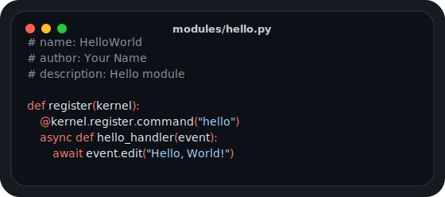

# Introduction

<p align="center">
  
</p>

← [Index](../../API_DOC.md)

**MCUB** (`Mitrich UserBot`) is a modular Telegram userbot framework built on [Telethon-MCUB](https://github.com/hairpin01/Telethon-MCUB).

## Features

- **Modules** - create module in `modules_loaded/`
- **Commands** - register commands with `@kernel.register.command()` [Docs](api/commands.md)
- **Watchers** - track messages with `@kernel.register.watcher()` [Docs](registration/watchers.md)
- **Events** - handle events with `@kernel.register.event()` [Docs](api/events.md)
- **Inline bots** - create inline forms and buttons `kernel.inline.form()` [Docs](inline/inline-form.md)
- **Scheduler** - schedule tasks with `kernel.scheduler` [Docs](api/scheduler.md)

> [!TIP]
> Try a new type of modules! Class-style Modules!
> -> [Docs](registration/class-style.md) <-
## Quick Start

### 1. Create a module

```python
# modules_loaded/hello.py
# name: HelloWorld
# author: Your Name
# description: Hello module
from core.lib.types import Kernel

def register(kernel: Kernel):
    @kernel.register.command(
		'hello',
		doc={
		    'ru': 'вывести hello, world',
		    'en': 'say hello, world'
		}
	)
    async def hello_handler(event):
        await event.edit("Hello, World!")
```

### 2. Run

```bash
python3 -m core
```

Use `.hello` in any chat.

## Learn More

- [Module Structure](../module-structure.md) - module structure, headers, directives
- [Command Registration](../api/commands.md) - command registration
- [Best Practices](../guides/best-practices.md) - recommended patterns
- [Class style](../registration/class-style) - New registration method
