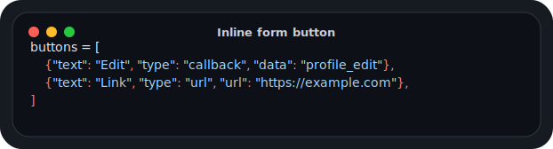
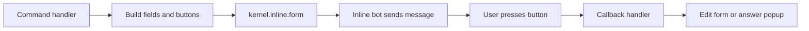
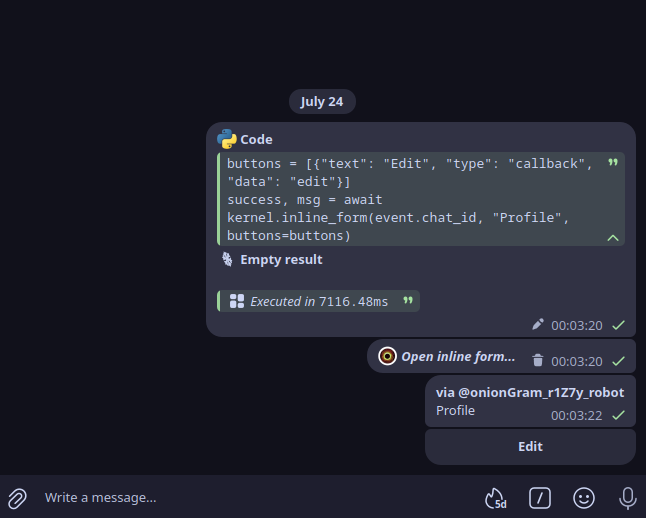

# Inline Form

<p align="center">
  
</p>

← [Index](../../API_DOC.md)

## `kernel.inline.form()` (alias) /  `kernel.inline_form` (old)

Sends an inline message with formatted fields and buttons.

## Inline Form Flow



## Telegram Preview

<p align="center">
  
</p>

### Parameters

- `chat_id` (int): Target chat ID
- `title` (str): Form title
- `fields` (dict | list, optional): Data to display
- `buttons` (list, optional): Button configuration
- `auto_send` (bool, default=True): If `True`, sends immediately
- `ttl` (int, default=200): Cache TTL for form (seconds)
- `reply_to` (int, optional): Topic/thread message ID for supergroups with topics.
  The inline form message and its result will be sent into this topic.

### Button Configuration

**Simplified format:**
```python
buttons = [
    {"text": "Edit", "type": "callback", "data": "profile_edit"},
    {"text": "Link", "type": "url", "url": "https://..."}
]
```

**Auto callback token (NEW):**
```python
from core_inline.api.inline import make_cb_button, cleanup_inline_callback_map

async def on_click(event, user_id):
    await event.answer(f"Hi {user_id}!", alert=True)

buttons = [
    make_cb_button(
        kernel,                      # required: holds inline_callback_map
        "Ping",                     # text
        on_click,                    # callable
        args=[123],                  # optional
        kwargs={"foo": "bar"},     # optional
        ttl=600,                     # optional, defaults 900s
        icon=5429283852684124412,    # optional premium emoji_id
        style="primary",           # optional style
        # token="fixed-token",      # optional fixed token
    )
]

# optional: clear expired tokens manually (usually not needed)
cleanup_inline_callback_map(kernel)
```
How it works:
- when building the form a random token is generated (or your `token` is used);
- the token is stored in `kernel.inline_callback_map` with your handler + args/kwargs;
- only `callback_data=<token>` goes into the button, so logs show a UUID-like string;
- TTL equals the form TTL (`ttl` of `create_inline_form` / `inline_form`); expired tokens are removed.

Notes:
- If you provide `data` without `callback`, the legacy scheme still applies (prefix bytes + `register_callback_handler`).
- Expired tokens are cleaned automatically when creating forms and on any button press.
- Telethon `Button.inline(...)` continues to work with explicit `data`; callable callbacks are only available via the dict format above.

**Readable CodeInline facade:**
```python
from core_inline.api import CodeInline, InlineButton, InlineKeyboard

async def on_save(event, item_id):
    await event.answer("Saved", alert=True)

ui = CodeInline(kernel, ttl=600)
buttons = InlineKeyboard().row(
    ui.action("Save", on_save, args=[item_id]),  # auto callback token
    InlineButton.url_button("Docs", "https://example.com"),
).rows

await ui.form(event.chat_id, "Settings", buttons=buttons)
```

Use this style for new code when a module needs a small inline workflow. It keeps
callback registration, TTL and button layout in one place while preserving the
old dict and Telethon button formats.

**Ready-made Telethon buttons:**
```python
from telethon import Button

buttons = [
    [Button.inline("Edit", b"edit_data")],
    [Button.url("Site", "https://...")]
]
```

### Usage Examples

```python
# Basic form
success, msg = await kernel.inline.form(event.chat_id, "User Profile")

# Form with fields
fields = {"Name": "John", "Status": "Active"}
success, msg = await kernel.inline.form(event.chat_id, "Profile", fields=fields)

# Form with buttons
buttons = [{"text": "Edit", "type": "callback", "data": "edit"}]
success, msg = await kernel.inline.form(event.chat_id, "Profile", buttons=buttons)

# Form in a topic (supergroup with topics)
reply_to = getattr(event.message, "reply_to", None) or event.message.id
success, msg = await kernel.inline.form(
    event.chat_id, "Topic Menu", fields=fields, reply_to=reply_to
)
```

---

## `kernel.inline.gallery()`

Sends an inline gallery with navigation buttons `[◀] [🔄] [▶]`.

```python
rows = [
    {"photo": "https://example.com/photo1.jpg", "text": "Item 1"},
    {"photo": "https://example.com/photo2.jpg", "text": "Item 2"},
]
success, msg = await kernel.inline.gallery(event.chat_id, "Gallery", rows=rows)
```

---

## `kernel.inline.list()`

Sends an inline list with pagination `[◀] [🔄] [▶]`.

```python
items = ["Item 1", "Item 2", "Item 3", "Item 4", "Item 5"]
success, msg = await kernel.inline.list(event.chat_id, "List", items=items)
```

---

## `kernel.inline.query()`

Performs an inline query through a bot and clicks on the selected result.

```python
success, message = await kernel.inline.query(
    chat_id=event.chat_id,
    query="gif cat",
    bot_username="gif"
)
```

---

## Complete Example with Callbacks

```python
@kernel.register.command('profile')
async def profile_handler(event):
    fields = {"name": "user", "status": "Active"}
    buttons = [{"text": "Play", "type": "callback", "data": "casino_play"}]

    # Detect topic context for supergroups with topics
    reply_to = getattr(event.message, "reply_to", None) or event.message.id

    success, msg = await kernel.inline.form(
        event.chat_id, "User Profile", fields=fields, buttons=buttons,
        reply_to=reply_to,
    )
    if success:
        await event.delete()

async def casino_callback_handler(event):
    data = event.data.decode('utf-8')
    if data == 'casino_play':
        await event.edit("Starting game...")

kernel.register_callback_handler('casino_', casino_callback_handler)
```
---
