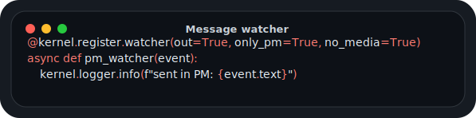
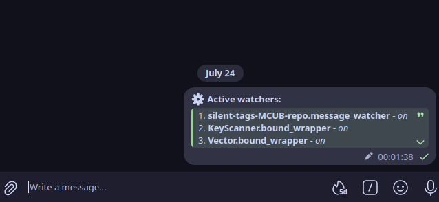

# Watchers

<p align="center">
  
</p>

← [Index](../../API_DOC.md)

> [!NOTE]
> This is the canonical watcher reference for both function-style and
> class-style modules. Other registration pages link here instead of repeating
> the same tags and examples.

`@kernel.register.watcher(bot_client=False, **tags)`
Register a passive message watcher. Fires on every new message and is cleaned up automatically on module unload.

## Syntax

```python
@kernel.register.watcher              # no filters
@kernel.register.watcher()             # no filters
@kernel.register.watcher(only_pm=True, no_media=True)   # with filters
@kernel.register.watcher(bot_client=True, incoming=True) # on bot client
```

## Available Tags

| Tag | Effect |
|---|---|
| `out=True` | Only outgoing messages |
| `incoming=True` | Only incoming messages |
| `only_pm=True` | Private chats only |
| `no_pm=True` | Exclude private chats |
| `only_groups=True` | Groups/supergroups only |
| `no_groups=True` | Exclude groups |
| `only_channels=True` | Channels only |
| `no_channels=True` | Exclude channels |
| `only_media=True` | Messages with any media |
| `no_media=True` | Text-only messages |
| `only_photos=True` | Photos only |
| `only_videos=True` | Videos only |
| `only_audios=True` | Audio files only |
| `only_docs=True` | Documents only |
| `only_stickers=True` | Stickers only |
| `no_photos/videos/audios/docs/stickers=True` | Exclude that media type |
| `only_forwards=True` | Forwarded messages only |
| `no_forwards=True` | Exclude forwards |
| `only_reply=True` | Replies only |
| `no_reply=True` | Exclude replies |
| `regex="pattern"` | Text matches regex |
| `startswith="text"` | Text starts with value |
| `endswith="text"` | Text ends with value |
| `contains="text"` | Text contains value |
| `from_id=<int>` | From specific user ID |
| `chat_id=<int>` | In specific chat ID |

## Examples

```python
def register(kernel):
    # Fire on every message
    @kernel.register.watcher
    async def log_all(event):
        kernel.logger.debug(f"msg: {event.text[:50]}")

    # Only outgoing PMs, no media
    @kernel.register.watcher(out=True, only_pm=True, no_media=True)
    async def pm_watcher(event):
        kernel.logger.info(f"sent in PM: {event.text}")

    # React to keyword
    @kernel.register.watcher(contains="кyпи cлoнa")
    async def elephant(event):
        await event.reply("A y нac ecть cлoны!")

    # Regex filter
    @kernel.register.watcher(regex=r"^\d{4,}$")
    async def numbers(event):
        await event.reply("That's a long number.")
```

## Class style

```python
from core.lib.loader.module_base import ModuleBase, watcher

class DemoWatchers(ModuleBase):
    name = 'demoWatchers'

    # Fire on every message
    @watcher
    async def log_all(self, event):
        self.log.debug(f"msg: {event.text[:50]}")

    # Only outgoing PMs, no media
    @watcher(out=True, only_pm=True, no_media=True)
    async def pm_watcher(self, event):
        self.log.info(f"sent in PM: {event.text}")

    # React to keyword
    @watcher(contains="кyпи cлoнa")
    async def elephant(self, event):
        await event.reply("A y нac ecть cлoны!")

    # Regex filter
    @watcher(regex=r"^\d{4,}$")
    async def numbers(self, event):
        await event.reply("That's a long number.")
```

<p align="center">
  
</p>

> [!TIP]
> Watcher errors are caught and logged automatically - a crash in one watcher never affects others.
